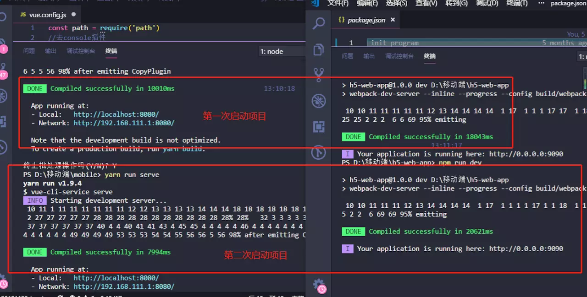

# vue cli 3.0 迁移项目（上）

`vue cli 3x` 发布已经有好长一段时间了，`webpack ` 现在版本已经到了 4.30.0；如果我们现在搭建项目很自然都是用的最新的稳定版本，蛮好的没有任何问题。
体验极致的开发体验那是必须的，可是问题来了，由于历史原因，我们公司项目使用的并不是最稳定的，每一次启动项目都需要很长一段时间，
每一次编译项目也要等很久。每次开发必吐槽


吐槽始终解决不了问题，与其吐槽不如自己动手去解决。最终决定尝试一下，推动项目框架升级这一路走的很艰辛，不管最后结果如何，都决定尝试尝试。但行好事莫问前程。

## 目前工作项目中的痛点
1. 项目编译很慢，`npm run dev` 或者 `npm run build` 或者每一次修改完代码再次编译，好像要等一个世纪一样久

2. 公司项目配套有10套环境，开发四套，测试四套，线上，灰度一套，每次切换环境都是在 `config/index` 手动改，有时候会不小心提交代码合并到主干发生意外

## 项目升级后解决了
1. 编译速度比以前快了很多

2. 实现了通过命令行去切换环境

3. 打包后的内存空间减少了90%+

## 升级后遗症

1. 更加了解整个项目

2. 熟悉 `pm2` 相关命名

3. `get` 新技能

## 项目实践 `vue cli 3.0`

初步尝试公司小项目，性能对比

`h5-web-app` 是  `vue cli 2x` 构建的 `"webpack": "^3.6.0"`

`mobile` 是  `vue cli 3x` 构建的 `"version": "4.26.1"`


注：`vue cli` 也是用 `vue cli3` 构建的项目
咋一看，好像目录结构都不一样了，我告诉你是的，相对于之前没那么啰嗦的，看上去更加简洁明了


## 性能对比
都是在同一台电脑，同一时刻运行的，尽最大可能的减少测试误差

本地启动项目（前后两次）




`build` 项目第一次


`build` 项目第二次


前后两次 `build` 的时间对比很明显，接近50%的提升，有点夸张了

打包后占用内存


打包后的大小也是有点惊人的


首页加载时间

`vue cli 3x` 构建的项目


`vue cli 2x` 构建的项目


用我司小项目做一个小小的尝试，看到很明显的性能。尝试性给公司大项目升级

个人认为 `webpack` 构建速度还是蛮重要的，深刻体会。实在是受不了每次编译所要等待时间，自己动手尝试了一下，新版本给我带来的感受。网传

夸张不夸张我不知道，但是自身体验有明显感觉到。


## 踩坑记
1. 资源预加载

`<link rel="prefetch"> `是一种 `resource hint`，用来告诉浏览器在页面加载完成后，利用空闲时间提前获取用户未来可能会访问的内容。
`vue cli3.0`  默认是开启这个模式的，如果项目小是一个优势，大型项目建议移除。

切换到公司大项目的时候就出问题了，如图


当时的我是慌的，一脸茫然的不知道为啥会这样，猜想过路由懒加载失效，上 `github` ，`goole` 寻找各种答案。很长时间都没有定位到问题，
想过要放弃，最后坚持下来了，成功解决了。开心


2. 通过命令行，切换环境，而不是手动去修改配置文件


`npm run build ` 会读取 `.env.production` 文件里面配置的环境变量

`npm run Devbuild ` 会读取 `.env.dev` 文件里面配置的环境变量

只有以`VUE_APP_ `开头的变量会被 `webpack.DefinePlugin` 静态嵌入到客户端侧的包中。

我在写配置文件的时候忽略掉了前面的 `VUE_APP_ `，还有 `.env `文本文件，每一行句末不能加逗号或者其他符号。
否者会导致读取不到环境变量，我在这个问题上挖了一个巨大的坑，花了我好长一段时间


小项目小尝试，`get` 到新的知识点

在实际的开发中遇到的问题，踩的坑远远不止上面哪几个，只是上面的印象深刻，小小记录一下。踩坑最久的还是 `pm2` ，因为公司项目使用他运行的。
后续分享

1.`mac自带了python2.7` 打包之后进入打包文件 `dist` 可以用`python -m SimpleHTTPServer 80` 启动项目，和好像和 `pm2` 效果一样的，

2.知道了一点点关于`SSR` 的知识点

是把这个工作放在服务器端做，直接在服务器端生成你想要的最终的页面，然后返回给浏览器，可以做`SEO`优化和首屏加载速度优化

3.`pm2 logs` 查看项目报错日志信息，定位问题，然后去解决

4.`netstat -an | grep 8081` 和 `lsof -nP -i tcp | grep node` 这两个命令应该是看端口号上面的吧

##### 我是初学者，很多地方不懂，说的不对，请多多指导


附上一份自己整理的 `webpack 4x` 的配置和 `vue cli 3x` 的配置

`vue.config.js`

```
const path = require('path')
//去console插件
const UglifyJsPlugin = require('uglifyjs-webpack-plugin')
//gzip压缩插件
const CompressionWebpackPlugin = require('compression-webpack-plugin')

function resolve(dir) {
  return path.join(__dirname, dir)
}
module.exports = {
  outputDir: process.env.outputDir,
  devServer: {
    proxy: {
      '/api': {
        target: 'http://192.168.0.001:8080',
        ws: true,
        changeOrigin: true,
        pathRewrite: {
          '^/api': ''
        }
      },
      '/gateApi': {
        target: 'http://192.168.0.002:8080',
        changeOrigin: true,
        pathRewrite: {
          '^/api': ''
        }
      },
      '/xsApi': {
        target: 'http://192.168.0.003:8080',
        changeOrigin: true,
        pathRewrite: {
          '^/xsApi': ''
        }
      }
    }
  },
  configureWebpack: config => {
  config.externals={
    vue: "Vue",
    vuex: "Vuex",
    "vue-router": "VueRouter",
    "element-ui": "ELEMENT",
    'v-charts':'VCharts',
    'echarts': 'echarts',
  }
    let plugins = [
      new UglifyJsPlugin({
        uglifyOptions: {
          compress: {
            warnings: false,
            drop_debugger: true,
            drop_console: true,
          },
        },
        sourceMap: false,
        parallel: true,
      }),
      new CompressionWebpackPlugin({
        filename: '[path].gz[query]',
        algorithm: 'gzip',
        test: new RegExp(
          '\\.(' + ['js', 'css'].join('|') +
          ')$',
        ),
        threshold: 10240,
        minRatio: 0.8,
      }),
    ]
    if (process.env.NODE_ENV !== 'development') {
    //在开发环境不压缩，有console日志
      config.plugins = [...config.plugins, ...plugins]
    }
  },
  lintOnSave: true,
  chainWebpack: (config) => {
    config.plugins.delete('prefetch'),
    //配置别名
    config.resolve.alias
      .set('@', resolve('src'))
      .set('@assets', resolve('src/assets'))
      .set('@constant', resolve('src/constants'))
      .set('@components', resolve('src/components'))
      .set('@base', resolve('src/base'))
      .set('@api', resolve('src/api'))
      .set('@common', resolve('src/common'))
      .set('@utils', resolve('src/utils'))
      .set('@router', resolve('src/router'))
      .set('@store', resolve('src/store'))
      .set('@mixin', resolve('src/mixin'))
      .set('@img', resolve('public/img'))
  }
}

```
